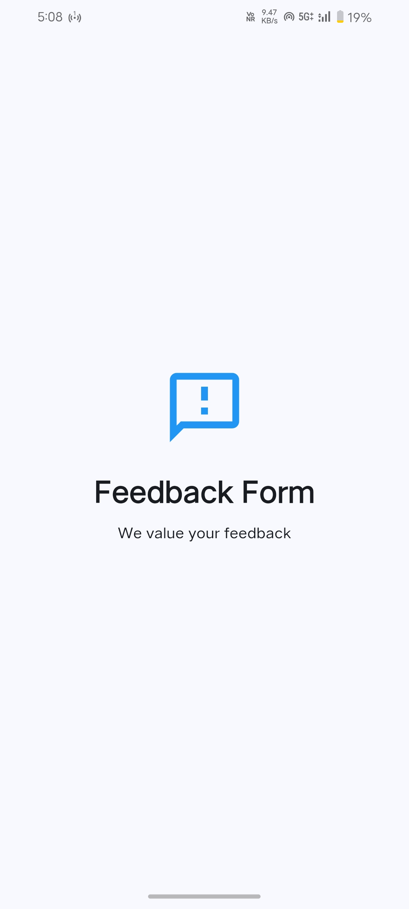
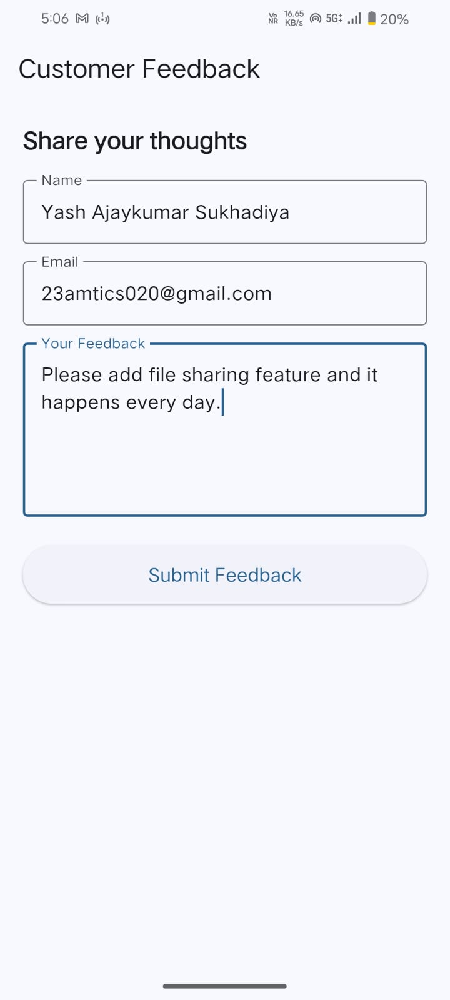
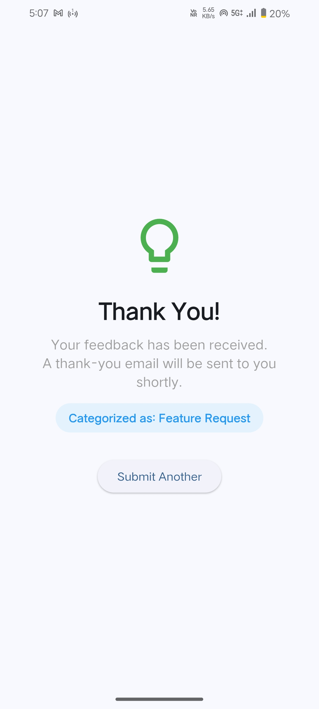
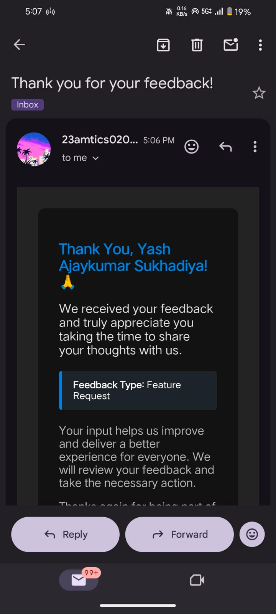

# Feedback Form App

A full-stack Flutter application that collects customer feedback, classifies it using a Machine Learning model, stores it in Firebase Firestore, and sends a thank-you email to the user.

---
## Screenshots

<p align="center">
  
  
</p>

<p align="center">
  
  
</p>

---

## Download APK

<p align="left">
  <a href="https://github.com/Yashsukhadiya1/feedback_form/raw/main/apk/app-release.apk">
    
  </a>
</p>

---

## Project Overview

This app allows customers to submit feedback through a clean mobile/web interface. The feedback is automatically classified into one of three categories using an ML model running on a FastAPI backend. The result is stored in Firebase Firestore and the user receives a personalized thank-you email.

---

## Full App Flow

```
Customer Opens App
       ↓
  Splash Screen (2 seconds)
       ↓
  Feedback Screen
  Enter: Name, Email, Feedback Message
       ↓
  Click "Submit Feedback"
       ↓
  Flutter sends data to FastAPI backend
  POST http://127.0.0.1:8000/predict
       ↓
  ML Model reads the feedback text
  Predicts one of:
    - Complaint
    - Compliment
    - Feature Request
       ↓
  FastAPI sends thank-you email to user's email
       ↓
  FastAPI returns predicted category to Flutter
       ↓
  Flutter saves feedback + category to Firebase Firestore
  Stored in separate collections:
    - complaints
    - compliments
    - feature_requests
       ↓
  Success Screen shown with:
    - Category label
    - Matching icon
    - "Submit Another" button
```

---

## Features

- Splash screen with app branding
- Feedback form with Name, Email, and Message fields
- ML-powered automatic feedback classification
- Firebase Firestore storage with separate collections per category
- Automated thank-you HTML email sent to the user
- Success screen showing the predicted category
- Loading state on submit button
- Error handling with snackbar messages
- Provider-based state management

---

## Tech Stack

| Layer | Technology |
|---|---|
| Frontend | Flutter (Dart) |
| State Management | Provider |
| Backend API | FastAPI (Python) |
| ML Model | Scikit-learn (TF-IDF + Logistic Regression) |
| Database | Firebase Firestore |
| Email | Gmail SMTP via smtplib |

---

## Project Structure

```
feedback_form/
├── lib/
│   ├── main.dart                  # App entry point, Firebase init, Provider setup
│   ├── screens/
│   │   ├── splash_screen.dart     # Opening screen, auto-navigates after 2s
│   │   ├── feedback_screen.dart   # Main form screen
│   │   └── success_screen.dart    # Shown after successful submission
│   ├── providers/
│   │   └── feedback_provider.dart # State management, orchestrates full flow
│   ├── services/
│   │   ├── api_service.dart       # HTTP calls to FastAPI backend
│   │   └── firebase_service.dart  # Firestore read/write operations
│   ├── models/
│   │   └── feedback_model.dart    # Data model for feedback
│   ├── widgets/
│   │   ├── custom_textfield.dart  # Reusable text input widget
│   │   └── custom_button.dart     # Reusable button with loading state
│   └── utils/
│       └── constants.dart         # API URL, collection names
│
├── backend/
│   ├── main.py                    # FastAPI app, /predict endpoint
│   ├── ml_model.py                # ML training, prediction logic
│   ├── email_service.py           # Gmail SMTP email sender
│   ├── large_feedback_dataset.csv # 9000-row training dataset
│   ├── model.pkl                  # Trained model (auto-generated)
│   ├── requirements.txt           # Python dependencies
│   └── .env                       # SMTP credentials (not committed)
```

---

## Firebase Firestore Collections

| Collection | Stores |
|---|---|
| `complaints` | Feedback classified as Complaint |
| `compliments` | Feedback classified as Compliment |
| `feature_requests` | Feedback classified as Feature Request |

Each document contains: `name`, `email`, `message`, `category`, `timestamp`

---

## Setup & Running

### Flutter App

```bash
flutter pub get
flutter run
```

### FastAPI Backend

```bash
cd backend
pip install -r requirements.txt
# Fill in your Gmail credentials in .env
uvicorn main:app --reload
```

### Email Setup

1. Enable 2-Step Verification on your Google account
2. Go to myaccount.google.com → Security → App Passwords
3. Generate a password for "Mail"
4. Add to `backend/.env`:

```
SMTP_USER=your_email@gmail.com
SMTP_PASS=your_16_char_app_password
```

---

## Running on a Physical Android Phone

### Step 1 — Connect phone to PC hotspot (or same WiFi)

Turn on your phone's hotspot and connect your PC to it.
Both devices must be on the same network.

### Step 2 — Find your PC's local IP

```bash
ipconfig
```

Look for "Wireless LAN adapter Wi-Fi" → IPv4 Address (e.g. `10.76.206.243`)

### Step 3 — Update API URL in Flutter

Open `lib/utils/constants.dart` and set:

```dart
static const String apiBaseUrl = 'http://YOUR_PC_IP:8000';
```

### Step 4 — Start FastAPI with host 0.0.0.0

```bash
uvicorn main:app --host 0.0.0.0 --port 8000 --reload
```

`--host 0.0.0.0` means the server listens on all network interfaces, not just localhost.
Without this, your phone cannot reach the server even on the same network.

### Step 5 — Allow port 8000 through Windows Firewall

Open PowerShell as Administrator and run:

```powershell
New-NetFirewallRule -DisplayName "FastAPI 8000" -Direction Inbound -Protocol TCP -LocalPort 8000 -Action Allow
```

Or manually:
1. Press `Win + R` → type `wf.msc` → Enter
2. Click Inbound Rules → New Rule
3. Select Port → TCP → Specific port: `8000`
4. Allow the connection → Finish

### Step 6 — Enable USB Debugging on phone

Settings → Developer Options → USB Debugging → ON

Connect phone via USB cable.

### Step 7 — Run the app

```bash
flutter run
```

Flutter detects your phone and installs the app on it.

---

## ML Model

- Dataset: 9,000 labeled feedback samples (3,000 per category)
- Algorithm: TF-IDF + Logistic Regression with custom sentiment features
- Accuracy: ~100% on test set
- Model is auto-trained on first run and saved as `model.pkl`
- To retrain: delete `model.pkl` and restart the server

---

## Flutter Dependencies

```yaml
firebase_core: ^3.6.0
cloud_firestore: ^5.4.4
firebase_auth: ^5.3.1
http: ^1.2.2
provider: ^6.1.2
```
